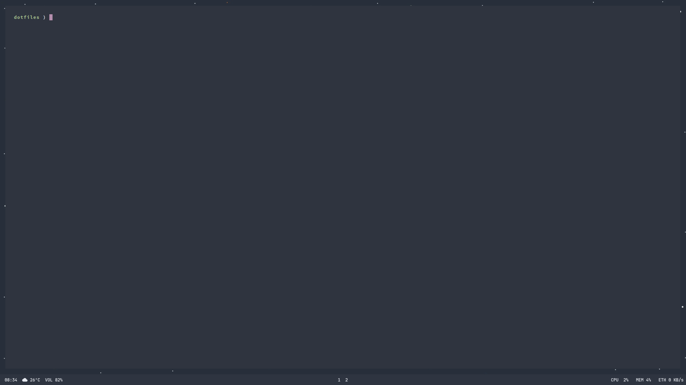

# Nord Material Theme Dotfiles

# Preview

# Required Packages:
- Source Code Pro
- rxvt-unicode
- fish
- i3-gaps
- polybar
- nautilus
- rofi
- dunst
- flameshot
- feh
- lxappearance-gtk3
- i3lock
- google-chrome-stable\
`yay -S adobe-source-code-pro-fonts rxvt-unicode fish i3-gaps polybar nautilus rofi dunst flameshot feh i3lock google-chrome lxappearance-gtk3`

# Polybar Required Packages:
- nerd-fonts-jetbrains-mono
- ttf-material-design-icons
- ttf-icomoon-fttf-icomoon-feathereather\
`yay -S ttf-icomoon-feather nerd-fonts-jetbrains-mono ttf-material-design-icons`

## Design Packages:
- [WhiteSur GTK Theme](https://github.com/vinceliuice/WhiteSur-gtk-theme) (Can't be installed through AUR)
- nordic-bluish-theme-git
- mojave-ct-icon-theme\
`yay -S nordic-bluish-theme-git mojave-ct-icon-theme`

## Optional
- [Google Chrome Nord Theme](https://chrome.google.com/webstore/detail/nord/abehfkkfjlplnjadfcjiflnejblfmmpj?hl=en-GB)

## Installation
- Install All The Packages Above
- Clone Repository Into ~ Folder
- Run `cp -a dotfiles/. .`
- Reboot  
